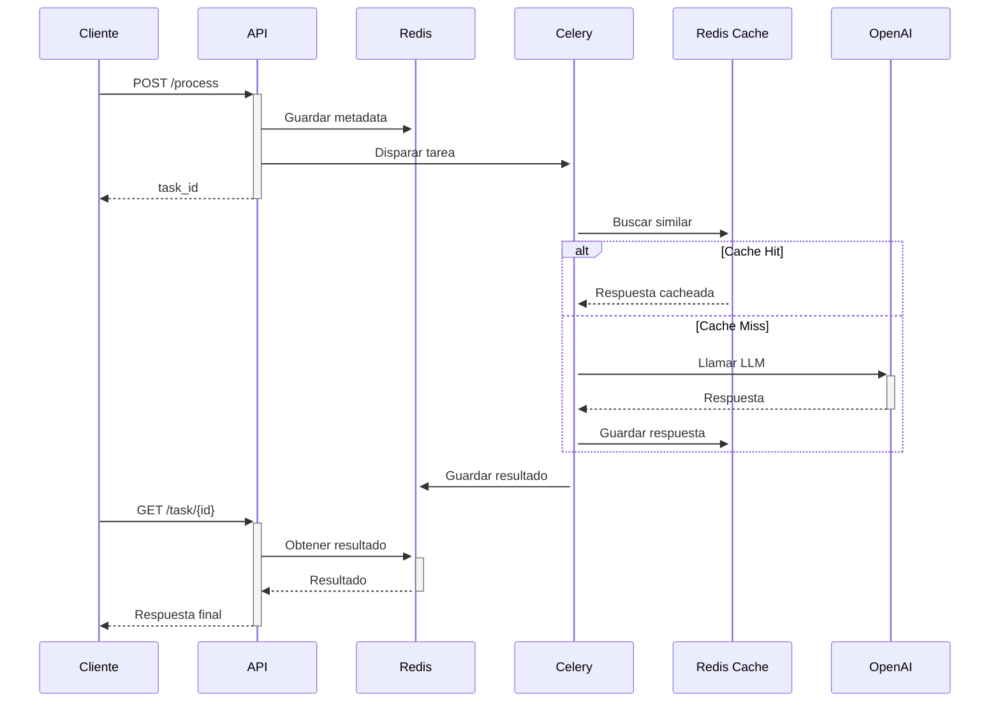
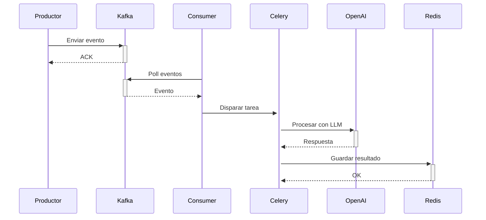

# Arquitectura del Sistema - AI-EventStream

Este documento detalla la arquitectura técnica del sistema AI-EventStream.

## 📐 Visión General

AI-EventStream es un sistema distribuido de procesamiento de IA que combina:
- **Ingesta masiva** de eventos con Apache Kafka
- **Procesamiento asíncrono** con Celery
- **Caché semántica** con Redis y búsqueda vectorial
- **API REST** con FastAPI

## 🏗️ Componentes Principales

### 1. FastAPI (Orquestador)

**Responsabilidades:**
- Exponer endpoints REST para clientes
- Validar y enrutar requests
- Gestionar estados de tareas
- Proporcionar métricas

**Tecnologías:**
- FastAPI 0.115+
- Uvicorn (ASGI server)
- Pydantic (validación)

**Endpoints Clave:**
```
POST /process          - Enviar tarea de procesamiento
GET  /task/{id}        - Consultar estado de tarea
GET  /metrics          - Métricas del sistema
GET  /workers          - Workers activos
GET  /health           - Health check
```

### 2. Celery (Motor de Procesamiento)

**Responsabilidades:**
- Ejecutar tareas de IA de forma distribuida
- Gestionar cola de tareas
- Reintentos automáticos
- Rate limiting

**Configuración Optimizada:**
```python
worker_prefetch_multiplier = 1      # Una tarea a la vez
task_acks_late = True                # Confirmar después de completar
worker_max_tasks_per_child = 100    # Reiniciar cada 100 tareas
```

**Queues:**
- `default`: Tareas generales
- `ai_processing`: Procesamiento de LLM
- `kafka_events`: Eventos de Kafka

### 3. Redis (Memoria y Broker)

**Roles Múltiples:**

**a) Broker de Celery (DB 1)**
- Cola de tareas pendientes
- Resultados de tareas

**b) Result Backend (DB 2)**
- Almacenamiento de resultados
- TTL de 1 hora

**c) Caché Semántica (DB 0)**
- Búsqueda vectorial con RedisVL
- Embeddings de consultas
- Respuestas de LLM

**Estructura de Datos:**
```
cache:{hash}:{task_type}
  - query: texto original
  - embedding: vector (1536 dims)
  - response: respuesta del LLM
  - metadata: tokens, modelo, etc.
  - task_type: tipo de tarea
```

### 4. Apache Kafka (Bus de Eventos)

**Responsabilidades:**
- Ingesta masiva de eventos
- Durabilidad y replicación
- Desacoplamiento de productores/consumidores

**Tópicos:**
- `datos_crudos`: Eventos entrantes
- `datos_procesados`: Resultados (opcional)

**Consumer Groups:**
- `ai_eventstream_consumers`: Grupo principal

### 5. Kafka Consumer (Dispatcher)

**Responsabilidades:**
- Escuchar eventos de Kafka
- Disparar tareas de Celery
- Gestionar offsets

**Patrón de Procesamiento:**
```
Kafka → Consumer → Celery Task → Redis Result
```

## 🔄 Flujos de Datos

### Flujo 1: API Request



### Flujo 2: Kafka Event



## 🧠 Caché Semántica

### Algoritmo de Búsqueda

1. **Generación de Embedding:**
   ```python
   embedding = openai.embeddings.create(
       model="text-embedding-3-small",
       input=query
   )
   ```

2. **Búsqueda Vectorial:**
   ```python
   results = index.query(
       vector=embedding,
       num_results=1,
       filter=Tag("task_type") == task_type
   )
   ```

3. **Cálculo de Similitud:**
   ```python
   similarity = 1 - (cosine_distance / 2)
   ```

4. **Decisión:**
   ```python
   if similarity >= threshold:  # 0.85 por defecto
       return cached_response
   else:
       call_llm()
   ```

### Beneficios

- **Reducción de Costos:** Evita llamadas redundantes a LLM
- **Baja Latencia:** Respuestas instantáneas desde caché
- **Escalabilidad:** Menos carga en APIs externas

### Métricas de Cache

```python
cache_hit_rate = cache_hits / total_requests
avg_similarity = sum(similarities) / cache_hits
cost_savings = cache_hits * avg_llm_cost
```

## ⚡ Optimizaciones de Rendimiento

### 1. Prefetch Multiplier = 1

**Problema:** Workers toman múltiples tareas y las bloquean
**Solución:** Una tarea a la vez para tareas pesadas de IA

### 2. Task Acks Late

**Problema:** Tarea se pierde si worker falla
**Solución:** Confirmar solo después de completar

### 3. Max Tasks Per Child

**Problema:** Fugas de memoria en bibliotecas de ML
**Solución:** Reiniciar worker cada 100 tareas

### 4. Connection Pooling

```python
redis = Redis(
    max_connections=50,  # Pool de conexiones
    socket_keepalive=True
)
```

### 5. Async I/O

```python
# FastAPI usa async/await
async def process_text(...):
    await redis.set_json(...)
    task = celery_task.apply_async(...)
```

## 🔒 Seguridad

### Rate Limiting

```python
class AITask(Task):
    _min_interval = 1.0 / (calls / period)
    
    def __call__(self, *args, **kwargs):
        time.sleep(self._min_interval)
        return super().__call__(*args, **kwargs)
```

### Validación de Input

```python
class ProcessRequest(BaseModel):
    text: str = Field(..., min_length=1, max_length=10000)
    task_type: str = Field(..., regex="^[a-z_]+$")
```

### Secrets Management

- Variables de entorno para credenciales
- No hardcodear API keys
- Usar servicios como AWS Secrets Manager

## 📊 Monitorización

### Métricas Clave

1. **Throughput:**
   - Tareas procesadas por segundo
   - Eventos de Kafka por segundo

2. **Latencia:**
   - Tiempo de procesamiento promedio
   - P50, P95, P99

3. **Cache:**
   - Hit rate
   - Similitud promedio

4. **Errores:**
   - Tasa de fallos
   - Reintentos

### Herramientas

- **Flower:** Dashboard de Celery
- **RedisInsight:** Explorador de Redis
- **Prometheus:** Métricas
- **Grafana:** Visualización

## 🚀 Escalabilidad

### Horizontal Scaling

**Workers de Celery:**
```bash
docker-compose up --scale worker=10
```

**API Instances:**
```bash
# Detrás de un load balancer
uvicorn main:app --workers 4
```

### Vertical Scaling

- Aumentar CPU/RAM de workers
- Usar instancias optimizadas para ML
- GPU para modelos locales (opcional)

### Auto-scaling

**Basado en métricas:**
- Queue length > 100 → Agregar workers
- CPU > 80% → Agregar instancias
- Cache hit rate < 50% → Revisar threshold

## 🔧 Configuración Avanzada

### Celery Routing

```python
task_routes = {
    'heavy_task': {'queue': 'gpu_queue'},
    'light_task': {'queue': 'cpu_queue'},
}
```

### Redis Persistence

```yaml
redis:
  command: redis-server --appendonly yes
  volumes:
    - redis_data:/data
```

### Kafka Partitioning

```python
producer.send(
    topic='datos_crudos',
    value=event,
    partition=hash(event['user_id']) % num_partitions
)
```

## 📈 Casos de Uso

### 1. Análisis de Sentimientos en Tiempo Real

- Reseñas de productos → Kafka
- Procesamiento con LLM
- Almacenamiento en Redis
- Dashboard en tiempo real

### 2. Moderación de Contenido

- Comentarios de usuarios → Kafka
- Clasificación con IA
- Acción automática si es tóxico

### 3. Resumen de Documentos

- PDFs/Artículos → Kafka
- Extracción de texto
- Resumen con LLM
- Indexación para búsqueda

## 🎯 Mejores Prácticas

1. **Idempotencia:** Tareas deben ser idempotentes
2. **Timeouts:** Configurar límites de tiempo
3. **Logging:** Logs estructurados con contexto
4. **Testing:** Tests unitarios y de integración
5. **Documentación:** Mantener docs actualizadas

## 🔮 Roadmap Futuro

- [ ] Soporte para múltiples LLMs (Anthropic, Cohere)
- [ ] Embeddings locales (Sentence Transformers)
- [ ] Streaming de respuestas (SSE)
- [ ] GraphQL API
- [ ] WebSockets para updates en tiempo real
- [ ] A/B testing de prompts
- [ ] Fine-tuning automático
